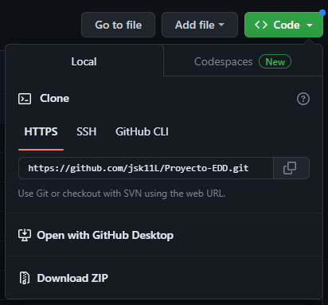
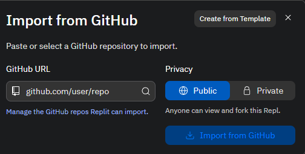
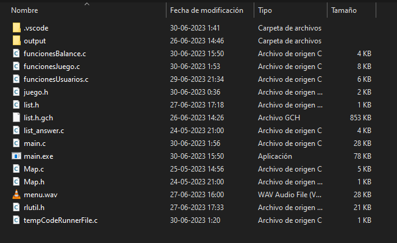

# ProyectoEDD

===== 1 - COMO COMPILAR Y EJECUTAR LA TAREA =====

- Para la ejecución y compilación del programa para la versión de Replit es posible mediante la importación
del código de GitHub a Replit. Eso se puede lograr mediante la opción Clone que tiene disponible GitHub:

- Luego en Replit usamos la función de importar desde GitHub copiando el link:

==================================================

- Para la ejecución y compilación del programa para la versión de Visual Studio Code procedemos a descargar
el siguiente archivo que contiene lo necesario:

[https://drive.google.com/file/d/1ahJ3uIgqbIcvhfRraj9DVJiufGI3ZoTs/view?usp=sharing]

- En este .rar tendremos que extraer e ingresar a la carpeta. En esta instancia podremos iniciar el .exe
de forma correcta y veremos el funcionamiento de la aplicación.

===== 2 - LO QUE FUNCIONA Y LO QUE NO =====

- En gran parte se logró con el objetivo del proyecto. El menú se logró implementar de forma correcta y en tiempo real que era la principal idea para que el aspecto del programa cumpliera con una atracción visual para el usuario.
  

===== 3 - HERRAMIENTAS UTILIZADAS =====

Las herramientas usadas en esencia fueron:

- Replit [https://replit.com/] : Se logró el trabajo en equipo mediante replit, donde pudimos analizar y cambiar grupalmente el código.

- GitHub [https://github.com] : El GitHub nos ayudó a implementar el repositorio y hacer el seguimiento con los commits.
 
- VS Code [https://code.visualstudio.com/] : Visual Studio Code fue clave para la implementación de una librería de terceros (rlutil.h) junto a conio.h y windows.h, ya que no era posible su implementación en replit para tener una consola (.exe) que cumpliera con nuestro objetivo.

